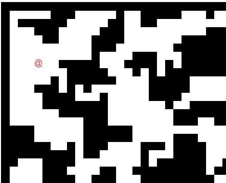

# Way cool Rogue like game with Create React App.

This project was bootstrapped with [Create React App](https://github.com/facebook/create-react-app).

## Available Scripts

In the project directory, you can run:

### `npm start`

Runs the app in the development mode.\
Open [http://localhost:3000](http://localhost:3000) to view it in the browser.

The page will reload if you make edits.\
You will also see any lint errors in the console.

## Cat's 'Rogue like game'
A take on the old school traditional Rogue game where Rogue is an @ symbol - use arrow keys to move
around the screen and keep away from the killer 'K' bosses!

Incorporating React hooks, an input manager, rot-js and more.

Game Set Up
===========
- Create a board to play on
- Create a player - give it a Rogue theme '@' symbol - but wait that's too old - update it to emojis!!
- Set up a dungeon world for the game - randomly generated used rot.js which is a cool library - rot sets up a randomGen dungeon.
- Set collision of player when hitting walls or going off the board.
- Set a base class that entities(monsters swords etc) inheret from so that all loot items tie in together.
- Add Monsters (entities) Loot (entities) stairs to go down to new level (entities because it's just cooler!)
- When player bumps into a wall - say 'way or route blocked'.
- When player picks up loot need an inventory to show on the screen and cap it so it doesn't just keep scrolling down!
- When player dies send message.
- Color and style and loot list needs to be added of course.

Here's a screenshot just after dungeon and player are set up and ready to rock around the world!

Inventory List
==============
@ = player - changed it up to King with Crown
/ = sword - changed it up to sword emoji
! = health potion - changed it up to hotdog
$ = gold coin of course - changed it up to moneybag
'#' = armour - changed it up to red truck
Emoji down arrow in yellow = stairs down - they will be towards the bottom right of each randomGen world.

Monsters List
=============
My take on funking it to the 21st C with emojis
Dragon - Dragon emoji
Ogre - Japanese ogre emoji (looks like a hairy red devil)
Wookie - Ninja cat emoji
Slime - Green Slime face emoji

the end - it works.
Ok, so you can add lots of extras sometime in the future and new levels.

